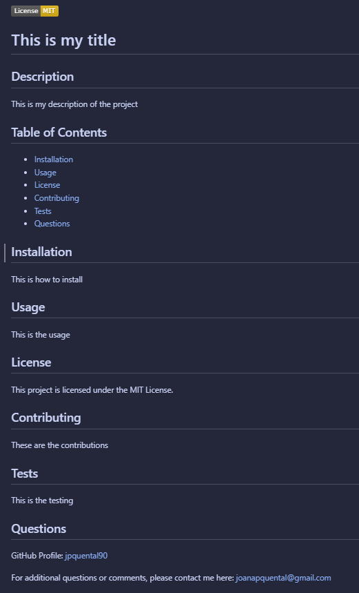

# Professional-README---edX-Bootcamp-Challenge-11

This repository contains my answer to the Module 11 Challenge of the Web Development edX bootcamp. A video walkthrough is available to see the application's functionality:

#### [Walkthrough Video](https://drive.google.com/file/d/1YHyrj9My0cV6ysvzc8prTDC6rLOTqWAn/view)
---

## Description

My task was to create a command-line application that dynamically generates a professional README.md file from a user's input using the Inquirer package.

## Table of Contents

* [Installation](#installation)
* [Usage](#usage)
* [Code](#code)
* [Credits](#credits)
* [License](#license)

## Installation

The application requires the use of Node.js and can be invoked by using the following command:

```bash
node index.js
```

## Usage

When the user enters the command above on the GitBash terminal, they will be prompted to answer the following questions:


</center>

A README.md file will be generated based on the user's input. Only the selected items in the table of contents will be generated into the file. The following is a screenshot of a README.md file generated in this way.


</center>

## Code

The development of this application used Javascript, Markdown and Node.js.

## Credits

I have used Google and Github to research the information I needed to complete the challenge. I used the Xpert Learning Assistant for some troubleshooting.

## License

Licensed under the MIT license.